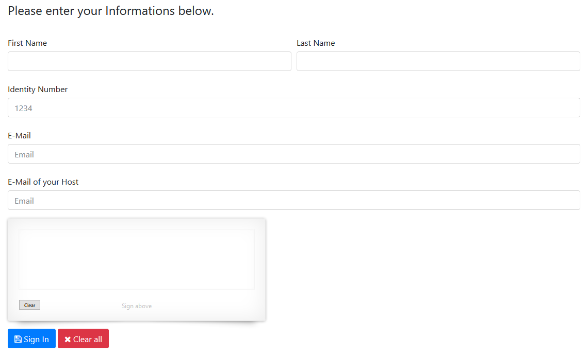

# VisitorRegistration

A simple Web App for registration of visitors and generating visitor a pass. 

## Screenshots

## Requierments
Microsoft .NET Framework 4.5.2

Entity Framework compatible Data Source (e.g. Microsoft SQL Server)
*MySQL could be workin, but may requiere some extra focus https://forums.mysql.com/read.php?174,601264,601264 

Microsoft IIS Server (WCF enabled)

## Installation
1) Create Database within SQL Server
2) Execute SQL Script
3) Open and use the Publish Feature in Visual Studio and deploy it to your Webserver
4) Update WCF Endpoint Address in VisitorRegistration.Web\Web.config
5) Update SQL Connection String in VisitorRegistration.Web\Web.config

# Disclaimer 
This App was only built for a PoC, and is not production ready.
